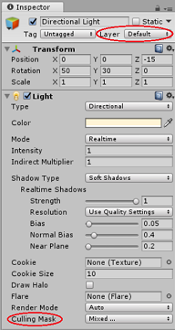

1. Cameras are important in Unity. The camera displays what the player of your game sees. Lights in Unity do exactly what they do in real life. You can move lights around to see objects better. Set the **Transform** of the "Main Camera" position to (0, 0, -15) and set the **Transform** of the "Directional Light" position to (0, 0, -15).

2. Create a 3D Object **Quad** and rename it to "Background" and set the **Transform** position to (0, 0, 1).

3. Drag the "SpaceNebula" image from the "Materials" folder in the **Project Viewer** and drop it on the Background object in the **Hierarchy**. 

4. Set the **Scale** of x and y on you "Background" **Quad** until it covers the entire Game Display. (Make sure it's set to the "Standalone" Aspect Ratio) Awesome, you have a background!

5. Now lets add something to control! From the "Prefabs" folder drag and drop the "Player" object onto your scene view. Set the **Transform** position to (0, 0, 0)

6. Did you notice that the spaceship has a shadow? It doesn't look very good so, you can get rid of it. To select which objects the "Directional Light" applies to you use the **Culling Mask** and **Layers** properties of the light. In the "Directional Light" **Inspector** click the "Layers" drop down on the top right.
    
Click "Add Layer...". In the first open layer type "Background" and go back to the "Directional Light" **Inspector**. Click the **Culling Mask** drop down menu and select "Everything". Now deselect the "Background" in the **Culling Mask**. The **Culling Mask** will now say "Mixed...". Go to your "Background" object's **Inspector** and select the layer drop down menu and set it to the "Background" layer you just created. There will be no more shadow!

7. To control the game with scripts without attaching them to a 3D object, "Empty Objects" can be used. Create an "Empty Object"(**GameObject > CreateEmpty**). Name this "Asteroid". Create another called "Lasers". 

8. Your scene should look like this when it is done!
    
    